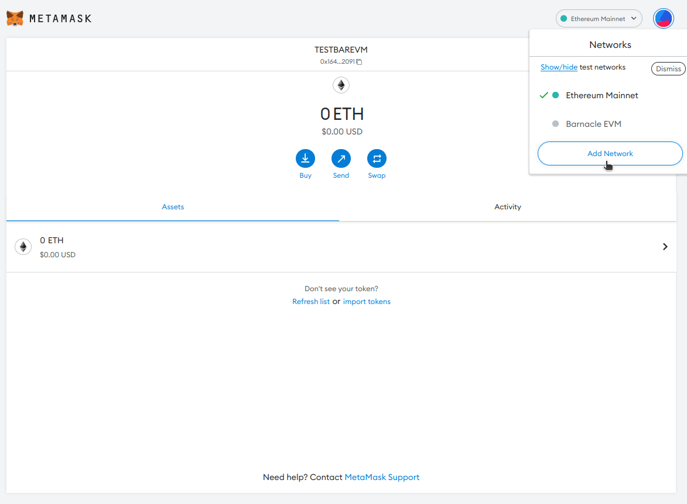
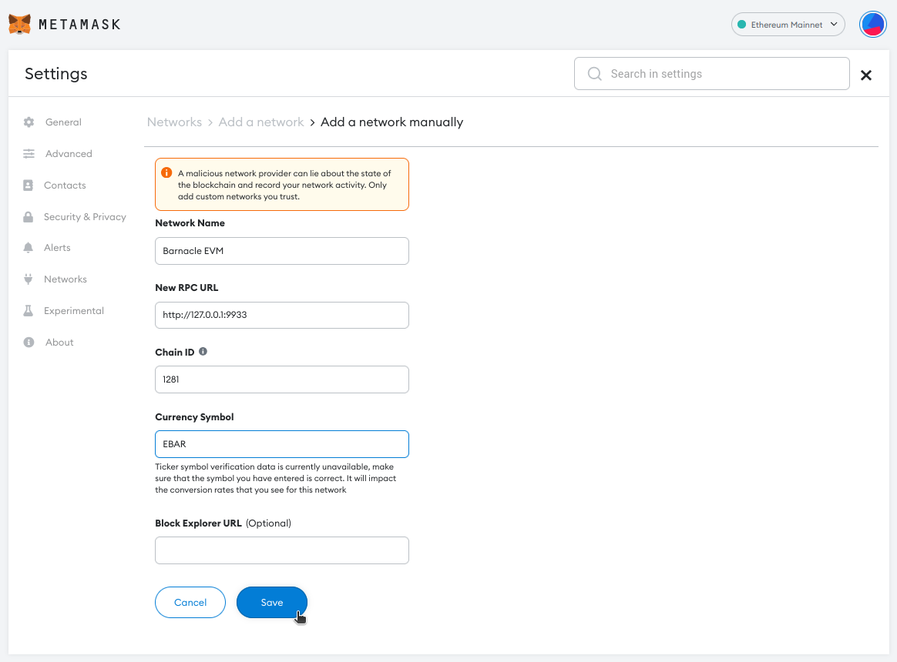
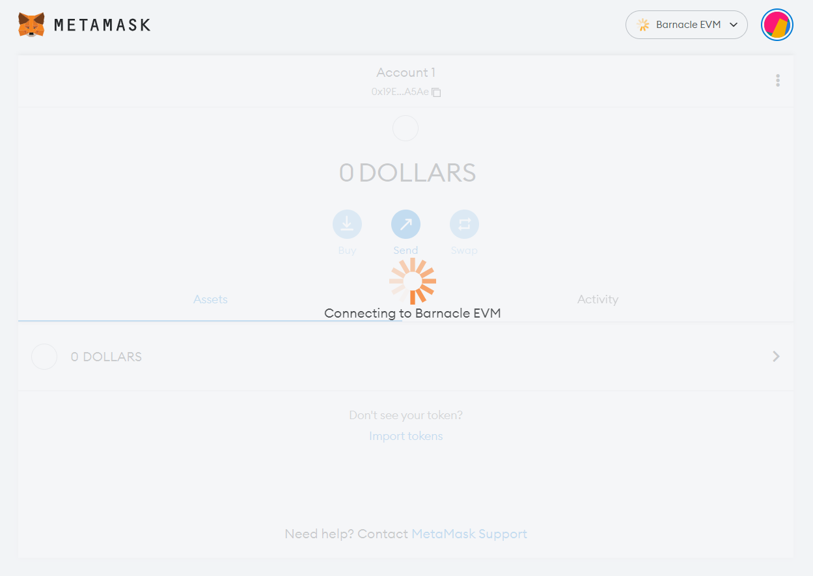
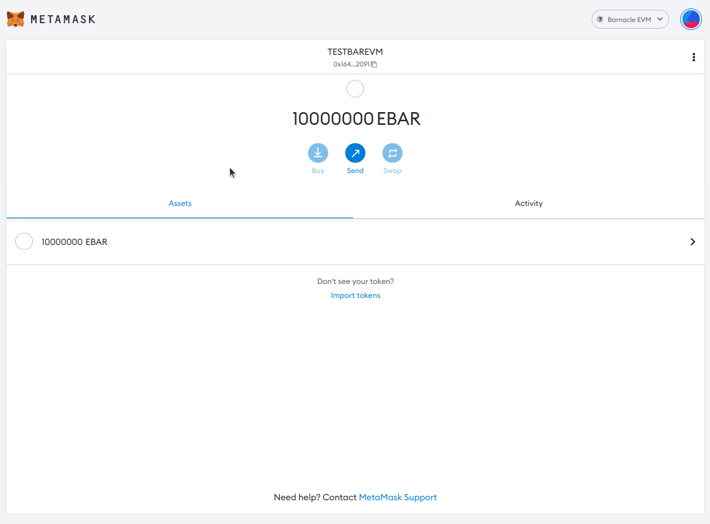

## EVM Uyumlu Appchain 

[Barnacle EVM](https://github.com/octopus-network/barnacle/tree/release-v0.9.18-evm), Octopus Network tarafından sağlanan EVM uyumlu bir uygulama zinciri geliştirme şablonudur. Parity tarafından geliştirilen [Frontier](https://github.com/paritytech/frontier) kullanır.

Geliştirici ekip, EVM uyumlu bir Appchain geliştirmek için bu şablonu kullanabilir. Octopus Network'te çalışan bir Appchain olarak Solidity tarafından yazılan DApp'lerini doğrudan konuşlandıran ekibi destekler. Appchain, otonom bir blok zinciri olmanın avantajlarından yararlanır. Ayrıca, [Octopus Network](https://oct.network/) tarafından esnek kiralık güvenlik, kullanıma hazır birlikte çalışabilirlik, zengin altyapı hizmetleri ve aktif bir topluluk sağlar.

Barnacle EVM Uygulama Zinciri, [Octopus Testnet](https://testnet.oct.network/appchains) içinde **Çalışıyor**. Barnacle EVM Uygulama Zincirinin RPC bağlantısı:

* RPC: https://gateway.testnet.octopus.network/barnacle-evm/wj1hhcverunusc35jifki19otd4od1n5
* Zincir Id: 1281
* Sembol: EBAR


## Octopus Barnacle EVM Nasıl Kullanılır?
 
### Octopus Network'ün Barnacle EVM'sini nasıl kullanabileceğinize dair izlenecek yol

Ethereum, blockchain ekosisteminin Fat-Hub'ı haline geldi. Parayı takip edin - dedikleri gibi. Büyüme arayan tüm birlikte çalışabilir blockchain projeleri, Web 3.0 varlıklarının çoğu orada olduğu için Ethereum ağına bağlanmalıdır. Bağımsız blockchain projelerinin çoğu, bazı EVM uyumluluk sistemlerine sahiptir. Bazıları köprüleri tercih ederken, diğerleri yerel zincirlerinde EVM uyumlu bir ortam oluşturur. EVM uyumlu bir Appchain'e sahip olmanın amacı, doğrulayıcılar ve uygulama kullanıcıları için ortamı kolaylaştırmaktır. Uygulama kullanıcıları MetaMask gibi EVM araç setlerini kullanır, ancak doğrulayıcılar yine de Polkadot.js eklenti cüzdanını kullanabilir.

Örneğin, Substrate'in arkasındaki şirket olan Parity, Substrate tabanlı blok zincirlerin Substrate blok zincirlerinde EVM uyumlu akıllı sözleşmelere sahip olmasına izin vermek için Frontier paletini yarattı. Bir Polkadot Parachain, %100 EVM uyumluluğu sözü olan Moonbeam'e dayanır.

Ahtapot Ağı ayrıca temel düzeyde EVM uyumluluğunu destekler. Appchain'ler NEAR'daki Substrate zincirleri olduğundan, Parity'nin Frontier paletlerini doğrudan Appchain'inizde kullanabilirsiniz. Octopus'un EVM uyumlu blok zincirinin temel şablonu, Parity'nin Frontier paletini kullanan [Barnacle EVM](https://github.com/octopus-network/barnacle/tree/release-v0.9.18-evm)'dir.

Nasıl çalıştığına dair size daha iyi bir fikir vermek için bu öğreticiyi takip edebilirsiniz.

### Yerel Bir Barnacle EVM Kurma

Barnacle EVM, Solidity akıllı sözleşmelerinizi, sözleşmeleri bir Testnet üzerinde dağıtmak zorunda kalmadan yerel bir blockchain ortamında test etmek için harika bir alternatiftir.


Öncelikle, orijinal Barnacle deposunu klonlamanız gerekir:

```
git clone https://github.com/octopus-network/barnacle
```


Ardından, klonlanan dizine gidin ve EVM şubesine girin.
```
cd barnacle
git switch release-v0.9.18-evm
```

Barnacle EVM'nin mevcut sürümü v0.9.18'dir, ancak gelecekteki güncellemeleri artıracaktır. En son güncellemeler için Barnacle deposundaki aktif dalları kontrol edebilirsiniz.

Barnacle EVM önceden belirlenmiş bir ortamdır ve herhangi bir süslü yapılandırmaya ihtiyacınız yoktur. Blok zincirini doğrudan çalıştırabilirsiniz ve kullanıma hazır olacaktır!


```
cargo build --release
./target/release/appchain-barnacle --dev --enable-offchain-indexing true
```

Blockchain'i çalıştırırken, yerel olarak çalıştırmak için --dev' bayrağını eklemeyi unutmayın.
Daha fazla ayrıntı için [README] belgesine başvurabilirsiniz.(https://github.com/octopus-network/barnacle/blob/release-v0.9.18-evm/README.md).

Tebrikler, ilk Barnacle EVM'nizi çalıştırdınız! `http://127.0.0.1:9933` üzerinden doğrudan EVM'ye bağlanabilirsiniz.

> Not: "9933" bağlantı noktasını kullanın. Varsayılan Substrate Websocket bağlantı noktası olan '9944'ten farklı olacaktır.

### Hardhat Kullanarak Barnacle EVM'ye Sözleşme Dağıtma

Akıllı sözleşmeleri Barnacle EVM'ye dağıtmak kolaydır. Süreci basitleştirmek için "docs/example" içinde sağlanan akıllı sözleşme şablonlarını kullanabilirsiniz. Hardhat, NodeJS kullanılarak oluşturulmuş bir Ethereum geliştirme ortamıdır, dolayısıyla onu kullanmak için NodeJS ve NPM'nin önceden yüklenmiş olması gerekir.

"docs/example" deposunu girin ve NPM kullanarak bağımlılıkları kurun:

```
cd docs/example
npm i
```

Dizinde bir "sözleşmeler" ve ".maintain" klasörü göreceksiniz. Kullanıma hazır akıllı sözleşmeleri "sözleşmeler" klasöründe görebilirsiniz. `.maintain`, dağıtım ve test dahil olmak üzere gerekli tüm komut dosyalarını barındıracaktır.

Hardhat proje şablonunun çalışması için bir `.env` dosyası gerekir:

```
BARNACLE_RPC_URL=http://127.0.0.1:9933
BARNACLE_DEPLOYER_PRIVATE_KEY=*private key here*
BARNACLE_ACCOUNT_PRIVATE_KEY=*private key here*
```

Sağlamanız gereken üç ortam değişkeni vardır. Ortam değişkenleri, "hardhat.config.js" dosyasında kullanılır.

Dosyayı açarsanız, bir "chainId" parametresi göreceksiniz. "chainId", ağ içindeki işlemleri imzalamak içindir. Barnacle EVM "chainId", "1281"dir. [Burada görüntüleyebilirsiniz](https://github.com/octopus-network/barnacle/blob/release-v0.9.18-evm/runtime/src/lib.rs#L752).

Özel anahtarları sağladıktan sonra, adres diğer zincirlerden farklı olacağından hesap adreslerinizi yazdırmanız gerekir. Barnacle EVM'ye bağlanmanız ve bir komut dosyası kullanarak adresleri manuel olarak almanız gerekir.

```
npx hardhat run .maintain/print-addresses.js --network barnacle
```

Komutunuz, ortak anahtarlarınız için genel adresleri yazdıracaktır:

```
Dağıtıcı özel anahtar hesap adresi: 0xf39Fd6e51aad88F6F4ce6aB8827279cffFb92266
Yürütücü özel anahtar hesap adresi: 0x70997970C51812dc3A010C7d01b50e0d17dc79C8
```

Aşağıdaki snippet [`node/src/chain_spec.rs`](https://github.com/octopus-network/barnacle/blob/release-v0.9.18-evm/node/src/chain_spec. rs) dosyasına önceden finanse edilen hesaplarınızı ekleyin.

```rust
// Pre-funded accounts
Some(
  vec![AccountId::from_str("f24FF3a9CF04c71Dbc94D0b566f7A27B94566cac").unwrap()],
)
```
Ayrıca, sudo hesabını istediğiniz gibi değiştirebilirsiniz.

```rust
// Sudo account
AccountId::from_str("f24FF3a9CF04c71Dbc94D0b566f7A27B94566cac").unwrap(),
```

Dosyada iki özdeş yapılandırma olduğunu, ancak farkın çalıştırma ortamı olduğunu unutmayın. Geliştirme ortamı olarak çalıştırıyorsanız, "development_config()" içindeki yapılandırmaları değiştirin. Yerel testnet ortamı olarak çalıştırıyorsanız, "local_testnet_config()" içindeki yapılandırmaları değiştirin.

Ardından, projenizin kök dizinine gidin, Barnacle EVM'yi yeniden oluşturun ve akıllı sözleşmeleri devreye alın:

```
cd ~/*work directory*/barnacle
cargo build --release
./target/release/appchain-barnacle --dev --enable-offchain-indexing true
cd docs/example
npx hardhat run .maintain/deployment.js --network barnacle
```

Dağıtım komut dosyasının içinde testleri de vardır ve bunun gibi bir şey döndürmesi gerekir:

```
Barnacle'a konuşlandırma http://127.0.0.1:9933
Hesapla sözleşme dağıtma: 0x4FF637E5326Ff581E8F62cd66BD116dd27Ac800B
Yürütücü şu hesapla sözleşme yapar: 0x19Ee2F7736Dcb4A76d567F35bfEf55aE24f7A5Ae
Sözleşmeler dağıtıldı!
Dağıtılan ERC20 sözleşme adresi 0xfBAf19640F23b36Df6d4d599aB8bCf2C92f95D69
Dağıtılan Escrow Sözleşmesi adresi 0x5a51cE149EcD3312C994Febaae69E4Beb939A0c6
Onaylanmış akıllı sözleşme!
İcra Hesabı Bakiyesi: 340282366920938463462374562926906777218
Yürütücü ERC20 Hesap Bakiyesi: 80000000000000000000
Yürütücü ERC20 Hesap Bakiyesi: 50000000000000000000
Yürütücü ERC20 Hesap Bakiyesi: 80000000000000000000
```

İşte bu kadar! İlk (iki) akıllı sözleşmenizi Barnacle EVM, bir ERC20 belirteci ve basit bir emanet akıllı sözleşmesi üzerinde devreye aldınız.

`ethers.js` kullanarak akıllı sözleşmenizle diğer herhangi bir ağda olduğu gibi etkileşim kurabilirsiniz; örnekler için `.maintain/deployment.js` komut dosyasına bakabilirsiniz.

### Barnacle EVM'yi MetaMask'a Bağlama

MetaMask hesabınızı Barnacle EVM'ye bağlayabilirsiniz.

Öncelikle, MetaMask'ı açmanız ve "Ağ Ekle" düğmesini bulmanız gerekir.



Ardından Barnacle EVM ayrıntılarını doldurun. Ağı "Barnacle EVM" olarak adlandırın, ardından varsayılan Barnacle EVM RPC'sini "http://127.0.0.1:9933" girin.

Bu belirli Barnacle EVM'nin zincir kimliği [1281](https://github.com/octopus-network/barnacle/blob/release-v0.9.18-evm/runtime/src/lib.rs#L752).

Barnacle EVM belirteci varsayılan olarak "EBAR" olarak adlandırılır. Ancak, yerel belirteci istediğiniz gibi adlandırabilirsiniz.

Formu doldurduktan sonra "Kaydet"e tıklayın.


MetaMask'ın bağlanması için bir saniye beklemeniz gerekebilir.

<!--  -->

Başarılı bir şekilde bağlandıysanız, varsayılan fonlarınızı görmelisiniz.



Barnacle EVM, H160 adreslerini kullanır ve Ethereum EVM ile uyumludur, Ethereum cüzdan özel anahtarlarınızı Barnacle'da gayet iyi kullanabilirsiniz.

### Sonuç

Barnacle EVM, EVM uyumlu Appchain'iniz için temel şablondur. Akıllı sözleşmelerinizi, tıpkı diğer Testnet ortamlarında olduğu gibi test etmek için Barnacle EVM'de konuşlandırabilirsiniz.

Barnacle EVM ile etkileşime geçmek için herhangi bir Ethereum geliştirme aracını kullanabilirsiniz. Bu izlenecek yolda, Hardhat kullandınız. Ancak Truffle, Remix, Brownie ve çok daha fazlası dahil olmak üzere kullanabileceğiniz başka ortamlar da vardır. Diğer örnekleri Moonbeam belgelerinde okuyabilirsiniz.

Daha fazla eğitime mi ihtiyacınız var? Lütfen Moonbeam Docs'tan [öğreticilere](https://docs.moonbeam.network/builders/build/eth-api/) bakın.
