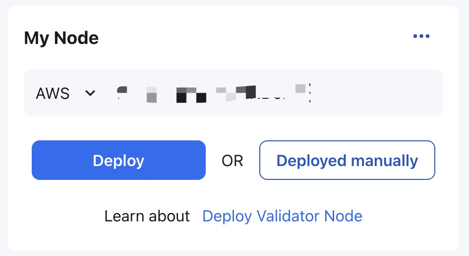
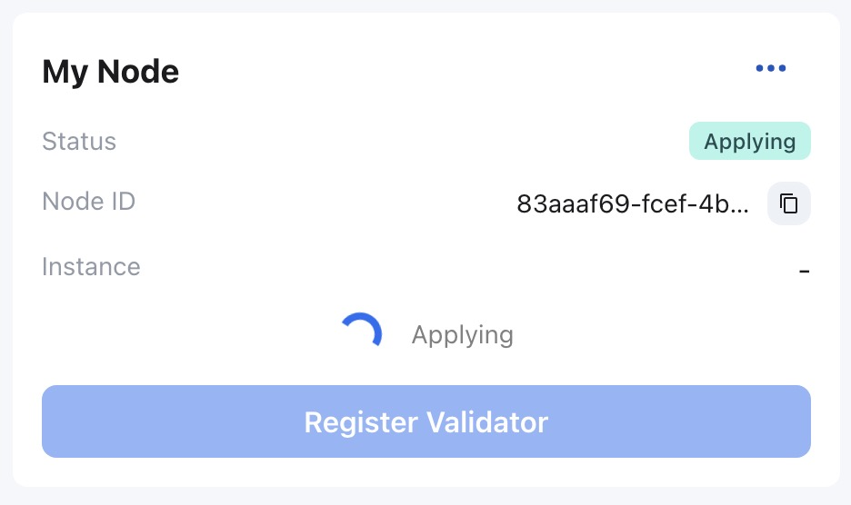
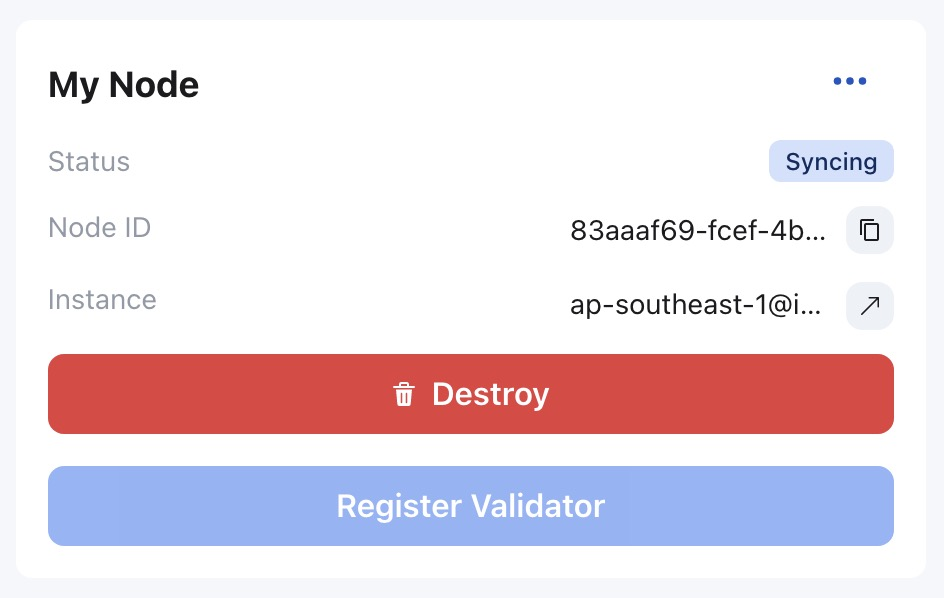

## Deploy Validator Node

In order to simplify the deployment of the validator node, the Octopus Network team provides an automatic deployment service for the validator node. Currently, it supports AWS and will support other cloud servers such as Digital Ocean and GCP in the future. Also, the validator can choose to [manually deploy the validator node](./validator-deploy-manually.md).

### Hardware configuration

The configuration and approximate cost of each Appchain validator node started by automatic deployment service.

| Appchain | AWS Instance Type  | Storage | Data Transfer | Total per month |
|------|------|------|------|------|
| debionetwork | t3.small  | 120 GB | 100 GB | $45 |
| myriad | t3.small  | 120 GB | 100 GB | $45 |
| deip | t3.small  | 120 GB | 100 GB | $45 |
| atocha | t3.small  | 120 GB | 100 GB | $45 |
| fusotao | c5.large  | 250 GB | 4500 GB | $509 |
| discovol | t3.small  | 120 GB | 100 GB | $45 |

### Using AWS Automatically Deploy

> If no AWS account, please firstly [create and setup AWS account](https://aws.amazon.com/getting-started/guides/setup-environment/?nc1=h_ls)
>
> To create [AWS Access Key](https://docs.aws.amazon.com/IAM/latest/UserGuide/id_credentials_access-keys.html)

Log in to the Octopus Network [mainnet](https://mainnet.oct.network) with the NEAR account created in [Generate Validator Account](./validator-generate-keys.md).

Click the `Appchains` and select the appchain which would like to be a validator, click it to open the appchain page, then perform the following operations:

1. In the **My Node** area of ​​the appchain page, input your `AWS Access Key` in the `Access Key` input box, then click `Deploy`;

2. The deployed AWS instance configuration information and approximate cost will be displayed in the **My Node** region. After confirmation, please input your `AWS Secret Key` in `Secret Key` input box and select the deployment area of the AWS instance in the `Deploy region` drop-down box, then click `Confirm`;

**Note**: The AWS Secret Key will only be used for this deployment and will not be stored anywhere.

3. In the **My Node** area, the node status is `Applying` which means the automatic deployment service is deploying the node.

Please wait for about 3~5 minutes, the node status will change to `Syncing` which means the validator node is synchronizing the block data of the appchain. The earlier the appchain is online, the longer the node synchronization time will be. please wait patiently.

To check the synchronization of nodes, please refer to [Monitor Node](./monitor-node.md).

After the node synchronization, the status in the **My Node** area will change to `Running`.

At this status, th validator can proceed to the next step [register validator](./validator-register.md).

#### Change AWS instance type

The validator can resize the AWS instance by changing the instance type as the appchain requirement change. Click the link to the right of `Instance` in the **My Node** region to open the console of the automatically deployed AWS EC2 instance, then, please refer to AWS EC2 [Changing the Instance Type](https://docs.aws.amazon.com/en_us/AWSEC2/latest/UserGuide/ec2-instance-resize.html) to complete the operation.

For the automatically deployed validator node, the validator can click `...` in the **My Node** area, and select `Instance Info` to check the hardware status information (such as CPU, hard disk, memory) of the running validator node instance.